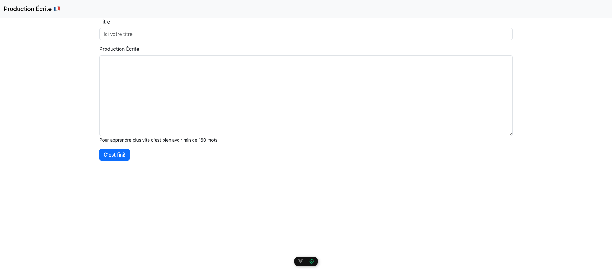
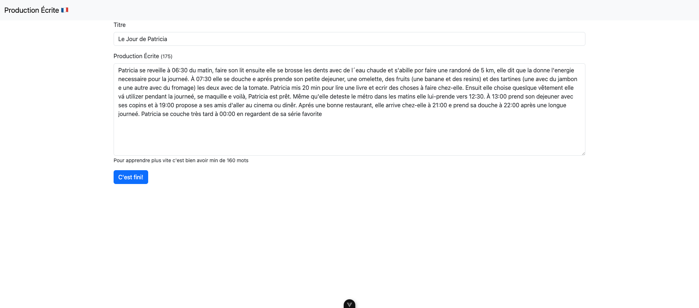
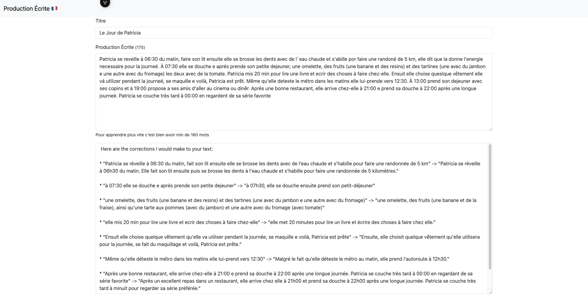

# French Assistent with AI 🇫🇷

A project made you to improve your french level using AI.
This project is only a template to be used with any AI. You can adapt with changing the env variables

## Important ⚠️

This project as made to learn and use AI as a tool. Please review any information after search it.

## Getting Started

For configure your AI please change the values in `src/views/HomeView.vue`. Update the values

```js
const host = '' // The host where your IA is running
const port = '' // The port
```

For this project was used the Ollama with Mistral. But feel free to use any other AI in the market.

## Running

⚠️ Please make sure your IA is running before execute this project.

To start the project please execute

```sh
npm run dev
```

This will be executed

```sh
> french_assistent_ai 0.0.0 dev
> vite

  VITE v5.4.3  ready in 408 ms

  ➜  Local:   http://localhost:5173/
  ➜  Network: use --host to expose
  ➜  Vue DevTools: Open http://localhost:5173/__devtools__/ as a separate window
  ➜  Vue DevTools: Press Option(⌥)+Shift(⇧)+D in App to toggle the Vue DevTools

  ➜  press h + enter to show help
```

## Demo Images

The project you should write a text in french to be corrected


After insert the text and click in _"C'est fini"_ you will see the correction below.

